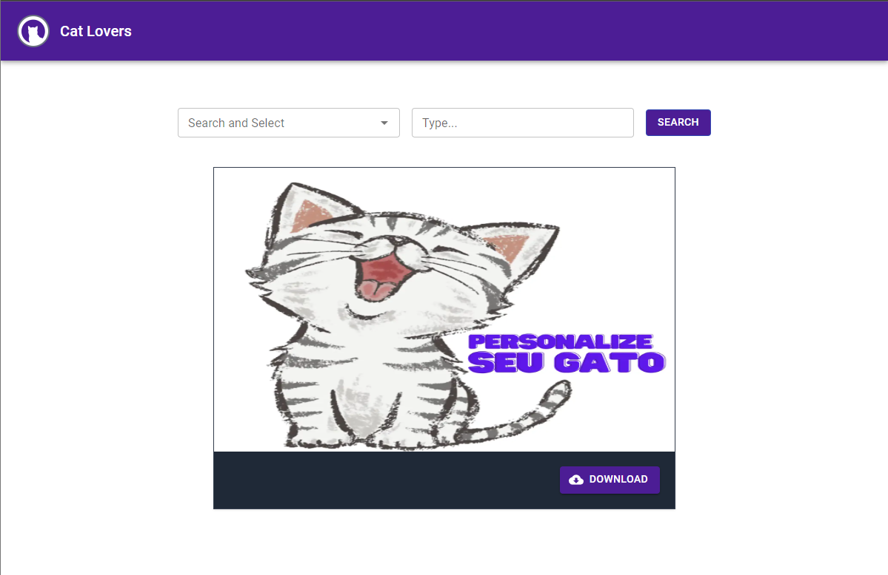

## Cat Lovers

Cat Lovers is a website created to customize cat images. This platform was developed as part of a challenge proposed by Think AI, an innovative technology company.



## Challenge instructions

Build a website that provides cat images based on text and tags entered by the user, using the "Cat as a Service" API (available at https://cataas.com/).

Business Rules:

The user can optionally add text to the generated image through a text field.
The user can define the desired cat tag.
Tags must be sorted in ascending order for selection through a selection field.
The user can select only one tag.
The generated image must be displayed as a preview within the site.
There must be a button to download the image.
When generating an image with the same text and tag, the same previously generated image must be returned.
Previous options matching the text entered by the user should be suggested during input.
Scalability:
The application must be able to handle a large amount of demand, using techniques such as caching, lazy loading, and other strategies to ensure low loading and processing times.

Technologies:
Recommended technologies include React, Angular, Vue.js (Front-end); Node.js, Python, Go, PHP, Java (Back-end). However, other technologies are welcome as long as they are well-founded and suitable for the project context.

The challenge aims to create a web application that offers an efficient and pleasant experience for users, allowing customization and quick access to cat images according to their preferences.

## Solution Approach

In the development of Cat Lovers, I used Nest.js for the backend, leveraging resources such as AWS S3 to store image URLs, and Redis to optimize data caching. For the user interface, I employed Next.js with TypeScript, ensuring a robust and typed approach to the frontend.

## 🛠 Tech Stack

- Next.js
- Tailwind CSS
- TypeScript
- Nest.js
- Prisma
- MySQL
- Redis
- S3 AWS
- Docker

## ⚙️ Quick Start 
Follow these steps to set up the project locally on your machine.

Prerequisites

Make sure you have the following installed on your machine:

- [Git](https://git-scm.com/)
- [Node](https://nodejs.org/en)
- [npm (Node Package Manager)](https://www.npmjs.com/)
- [Docker](https://www.docker.com/)

Cloning the Repository

```
git clone https://github.com/maxfortune93/challenge_think_ai.git

```

Set Up Environment Variables

Create a new file named .env.local in the root of your project Front-end project and .env in your back-end. 

## .env.local

```
NEXT_PUBLIC_BACKEND_URL=http://localhost:4000
```

## .env
Register for free on [Amazon](https://aws.amazon.com/pt/free), create a bucket, and provide your credentials along with the name of your bucket and the regions.
```
DATABASE_URL="mysql://root:root@db:3306/db_cataas"
CATAAS_API_URL=https://cataas.com
S3_BUCKET='your bucket'
AWS_S3_REGION='the region'
AWS_ACCESS_KEY_ID='your access id'
AWS_SECRET_ACCESS_KEY='your secret access key'
REDIS_HOST=redis
REDIS_PORT=6379
```

Running the Project

As the project is configured to work in Docker, there's no need to run the npm run dev command or install it. Instead, simply use the Docker command to start both environments, both the backend and the frontend. Make sure to execute the docker command to ensure proper container construction.
```
docker compose up --build 
```

Open [http://localhost:3000](http://localhost:3000) with your browser to see the result.
